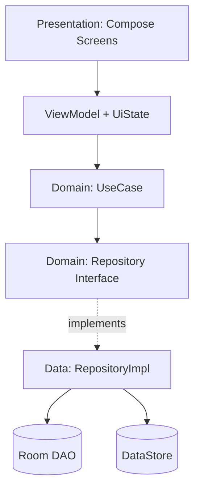

# Kazio — Mimari Rehberi (Clean Architecture + MVVM)

> **Ajana not:** Kullanıcı "MVC mimarisi" istedi. Ancak Android + Jetpack Compose ekosisteminde MVC idiyomatik değildir ve resmi Android önerisi de bu yönde değildir. Bunun yerine aynı temel felsefeyi (View'i iş kuralından ve veri erişiminden izole etmek) sağlayan, proje zaten Kotlin/Compose/Room/Hilt/DataStore ile kurulduğu için doğal olarak uyan **MVVM + Clean Architecture (katmanlı mimari)** kullanılacaktır. Bu dosyadaki kurallara harfiyen uyulacak; başka bir mimari desene kendiliğinden geçilmeyecek.

## Katman Diyagramı



## Katmanlar

### Presentation (`app/presentation`)
- Composable'lar **stateless** olmalı; state hoisting kullanılır (state ve event lambda'ları parametre olarak gelir)
- Her ekranın bir `ViewModel` + bir `UiState` (sealed interface veya data class) sahibi olur
- ViewModel; Room, DataStore veya herhangi bir Android framework sınıfını doğrudan bilmez, yalnızca UseCase çağırır

### Domain (`app/domain`)
- Framework'ten bağımsız, saf Kotlin (Android importu içermez)
- `UseCase` sınıfları tek sorumluluk taşır: `AddIncomeUseCase`, `CalculateDailyNetUseCase`, `StartShiftUseCase`, `CalculateHourlyNetUseCase` vb.
- Repository **interface**'leri burada tanımlanır (Dependency Inversion Principle burada uygulanır)

### Data (`app/data`)
- Room Entity + DAO tanımları
- DataStore (kullanıcı tercihleri, premium durumu)
- `RepositoryImpl`, domain'deki interface'i implemente eder; Entity ↔ Domain Model dönüşümü ayrı bir `Mapper` sınıfında yapılır (ViewModel veya UseCase içinde inline dönüşüm yapılmaz)

## Klasör Yapısı
```
app/
 ├─ presentation/
 │   ├─ dashboard/      (DashboardScreen.kt, DashboardViewModel.kt, DashboardUiState.kt)
 │   ├─ addincome/
 │   ├─ addexpense/
 │   ├─ summary/
 │   └─ settings/
 ├─ domain/
 │   ├─ model/          (Income.kt, Expense.kt, Shift.kt, Platform.kt)
 │   ├─ repository/     (IncomeRepository.kt — interface)
 │   └─ usecase/        (AddIncomeUseCase.kt, GetDailyNetUseCase.kt, ...)
 ├─ data/
 │   ├─ local/room/     (entities, dao, KazioDatabase.kt)
 │   ├─ local/datastore/
 │   ├─ repository/     (IncomeRepositoryImpl.kt)
 │   └─ mapper/
 └─ di/                 (Hilt modülleri: DatabaseModule, RepositoryModule, DataStoreModule)
```

## SOLID Uygulaması (somut kurallar)
- **SRP**: Bir UseCase tek bir iş yapar. Bir ViewModel tek bir ekranı yönetir. "Manager", "Helper" gibi belirsiz isimli, çok işlevli sınıflar yasak.
- **OCP**: Yeni bir platform eklemek (örn. "Marti") kod değişikliği değil, veritabanına satır eklemek olmalı. Platform listesi enum olarak sabitlenmez.
- **LSP**: Bir repository interface'ini implemente eden her sınıf, çağıranın beklentisini bozmadan (aynı sözleşmeyle) değiştirilebilir olmalı.
- **ISP**: `IncomeRepository`, `ExpenseRepository`, `ShiftRepository` ayrı interface'ler olarak tutulur. Tek bir dev "DataRepository" god-interface yasaktır.
- **DIP**: ViewModel somut `RepositoryImpl`'e değil, domain'deki `Repository` interface'ine bağımlıdır; bağlama Hilt üzerinden yapılır.

## Tek Yönlü Veri Akışı (UDF)
```
Event (kullanıcı etkileşimi) → ViewModel → UseCase → Repository → Room/DataStore
State (Flow)                 → Repository → UseCase → ViewModel (StateFlow) → UI (collectAsStateWithLifecycle)
```

## Hilt Modülleri (asgari)
- `DatabaseModule`: Room instance ve DAO provider'ları
- `RepositoryModule`: interface → implementasyon bağlama (`@Binds`)
- `DataStoreModule`: Preferences DataStore provider

## Kesin Yasaklar
- ViewModel içinde `Context` referansı tutmak yasak (memory leak riski); zorunluysa `@ApplicationContext` inject edilir, alan olarak saklanmaz
- Presentation katmanında iş kuralı (örn. net kazanç hesaplama, saatlik kazanç formülü) yazmak yasak — bu UseCase'in sorumluluğudur
- Domain katmanının Data veya Presentation katmanına bağımlı olması yasak (bağımlılık yönü her zaman içe doğrudur: Presentation → Domain ← Data)
